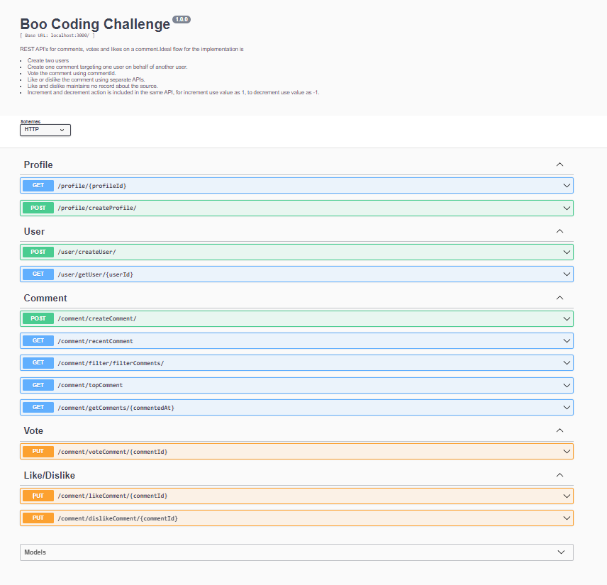

## Boo Coding Assignment
REST API's for comments, votes and likes on a comment.

##### How to run
Ideal flow for the implementation is
- Create two users
- Create one comment targeting one user on behalf of another user.
- Vote the comment using commentId.
- Like or dislike the comment using separate APIs.
- Like and dislike maintains no record about the source.
- Increment and decrement action is included in the same API, for increment use value as 1, to decrement use value as -1.

##### Server
```
npm install
npm run doc
```

##### Tests
```
npm test
```

##### API Specs (Swagger)
http://localhost:3000/doc

##### Test Result
```
henshalb@DESKTOP-1RI3ITT:~/boo-coding-assigment/server$ npm test

> server@1.0.0 test /home/henshalb/boo-coding-assigment/server
> jest --runInBand --detectOpenHandles

 PASS  tests/profile.router.test.js
 PASS  tests/like.router.test.js
 PASS  tests/comments.router.test.js
 PASS  tests/commentsFilter.router.test.js
 PASS  tests/vote.router.test.js
 PASS  tests/user.router.test.js
 PASS  tests/user.model.test.js
 PASS  tests/comments.model.test.js
 PASS  tests/profile.model.test.js

Test Suites: 9 passed, 9 total
Tests:       21 passed, 21 total
Snapshots:   0 total
Time:        9.346 s
Ran all test suites.
```

##### Notes
- Used mongodb field id as object identifiers (`_id`)
- Landing pages serves for a profile which exists. So,
    1. Create profile first
    2. Call /profile/{profileId}

##### Swagger Screenshot


##### Dependencies
```
{
    "dotenv": "^16.0.1",
    "ejs": "^3.1.6",
    "express": "^4.18.1",
    "jest": "^28.1.3",
    "mongodb-memory-server": "^8.8.0",
    "mongoose": "^6.5.2",
    "mongoose-to-swagger": "^1.4.0",
    "supertest": "^6.2.4",
    "swagger-autogen": "^2.21.5",
    "swagger-ui-express": "^4.5.0",
    "winston": "^3.8.1"
}
```
